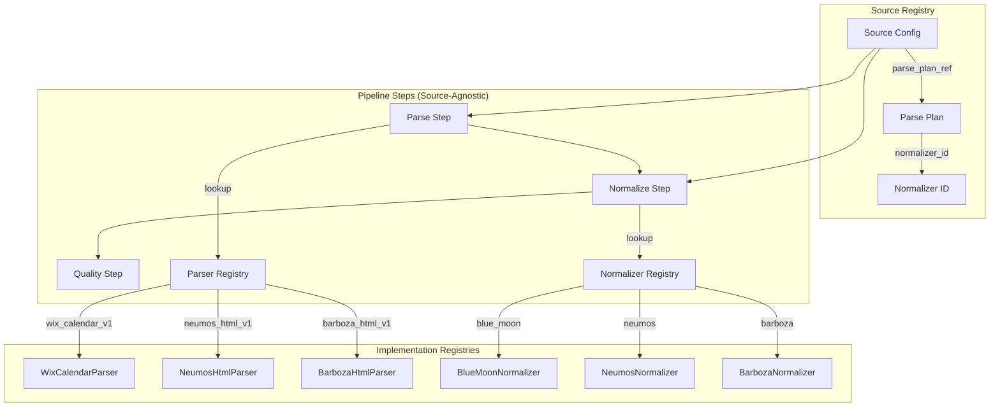

# Source-Agnostic Pipeline Architecture Redesign

## Current State Analysis

### What Exists ✅
1. **Source Registry System** 
   - ✅ JSON schema validation (`registry/schema/source-spec.v1.json`)
   - ✅ Source configurations (`registry/sources/*.json`)
   - ✅ Source loader (`sms-scraper/src/registry/source_loader.rs`)
   - ✅ Parse plan references in source configs (`parse_plan_ref`)

2. **Parser Factory System**
   - ✅ Parser factory with plan-based routing (`sms-scraper/src/infra/parser_factory.rs`)
   - ✅ Individual parser implementations (WixCalendar, DarrellsHtml, etc.)
   - ✅ Metrics-wrapped parsers

3. **Normalizer Registry**
   - ✅ Complete normalization registry (`sms-scraper/src/pipeline/processing/normalize/registry.rs`)
   - ✅ All source-specific normalizers implemented
   - ✅ Metrics-wrapped normalizers

### Current Problems ❌
1. **Pipeline Steps Are Source-Aware**
   - Parse step has hardcoded source ID mappings
   - Normalize step only handles `blue_moon` (hardcoded match)
   - Steps know about specific sources instead of being generic

2. **Disconnected Registries**
   - Parser factory uses parse_plan_ref but isn't connected to pipeline steps
   - Source registry exists but isn't used by individual pipeline steps
   - No unified configuration flow from source → parse plan → parser → normalizer

3. **Manual Source Addition**
   - Adding new venues requires code changes in multiple places
   - No automatic registry discovery

## Target Architecture

### Core Principle: Source-Agnostic Pipeline Steps



### Data Flow

```
Source ID → Source Config → Parse Plan → Parser Implementation
Source ID → Source Config → Normalizer ID → Normalizer Implementation
```

## Implementation Plan

### Phase 1: Extend Source Configuration Schema

**File: `registry/schema/source-spec.v2.json`**

Add pipeline configuration to source schema:
```json
{
  "pipeline": {
    "parser_id": "wix_calendar_v1",
    "normalizer_id": "blue_moon",
    "quality_rules": ["required_fields", "date_validation"],
    "enrichment_rules": ["geolocation", "venue_metadata"]
  }
}
```

### Phase 2: Unified Source Registry

**File: `sms-scraper/src/registry/unified_registry.rs`**

```rust
pub struct UnifiedSourceRegistry {
    sources: HashMap<String, SourceConfig>,
    parser_factory: Box<dyn ParserFactory>,
    normalizer_registry: NormalizationRegistry,
}

impl UnifiedSourceRegistry {
    pub fn get_parser_for_source(&self, source_id: &str) -> Result<Box<dyn ParserPort>> {
        let source = self.get_source_config(source_id)?;
        let parse_plan = source.pipeline.parser_id;
        self.parser_factory.for_plan(&parse_plan)
    }
    
    pub fn get_normalizer_for_source(&self, source_id: &str) -> Result<&dyn SourceNormalizer> {
        let source = self.get_source_config(source_id)?;
        let normalizer_id = source.pipeline.normalizer_id;
        self.normalizer_registry.get_normalizer(&normalizer_id)
    }
}
```

### Phase 3: Source-Agnostic Pipeline Steps

**File: `sms-scraper/src/pipeline/steps/parse.rs`**

```rust
#[async_trait]
impl PipelineStep for ParseStep {
    async fn execute(&self, source_id: &str, storage: &dyn Storage) -> Result<StepResult> {
        // Get raw data (source-agnostic)
        let raw_data = storage.get_raw_data_for_source(source_id).await?;
        
        // Get parser from unified registry
        let parser = self.registry.get_parser_for_source(source_id)?;
        
        // Parse data (source-agnostic)
        for data in raw_data {
            let parsed = parser.parse(&data.content).await?;
            storage.store_parsed_data(parsed).await?;
        }
        
        Ok(StepResult::success(processed_count, "Parse completed"))
    }
}
```

**File: `sms-scraper/src/pipeline/steps/normalize.rs`**

```rust
#[async_trait]
impl PipelineStep for NormalizeStep {
    async fn execute(&self, source_id: &str, storage: &dyn Storage) -> Result<StepResult> {
        // Get parsed data (source-agnostic)
        let parsed_data = storage.get_parsed_data_for_source(source_id).await?;
        
        // Get normalizer from unified registry
        let normalizer = self.registry.get_normalizer_for_source(source_id)?;
        
        // Normalize data (source-agnostic)
        for data in parsed_data {
            let normalized = normalizer.normalize(&data)?;
            storage.store_normalized_data(normalized).await?;
        }
        
        Ok(StepResult::success(processed_count, "Normalize completed"))
    }
}
```

### Phase 4: Enhanced Source Configurations

Update all source configs to include pipeline information:

**File: `registry/sources/blue_moon.json`**
```json
{
  "source_id": "blue_moon",
  "parse_plan_ref": "parse_plan:wix_calendar_v1",
  "pipeline": {
    "parser_id": "wix_calendar_v1",
    "normalizer_id": "blue_moon",
    "content_type": "application/json",
    "parser_type": "wix_calendar"
  }
}
```

**File: `registry/sources/neumos.json`**
```json
{
  "source_id": "neumos", 
  "parse_plan_ref": "parse_plan:neumos_html_v1",
  "pipeline": {
    "parser_id": "neumos_html_v1",
    "normalizer_id": "neumos",
    "content_type": "text/html",
    "parser_type": "html_scraper"
  }
}
```

### Phase 5: Parser Registry Enhancement

**Goal**: Make parsers reusable across sources with similar formats

**File: `sms-scraper/src/registry/parser_registry.rs`**

```rust
pub struct ParserRegistry {
    parsers: HashMap<String, ParserType>,
}

pub enum ParserType {
    WixCalendar(WixCalendarParser),
    HtmlScraper(HtmlScraperParser),
    JsonApi(JsonApiParser),
    GraphQL(GraphQLParser),
}

impl ParserRegistry {
    pub fn get_parser(&self, parser_id: &str) -> Result<&ParserType> {
        // Multiple sources can use the same parser type
        // e.g., "sunset_tavern" and "blue_moon" both use WixCalendar
    }
}
```

## Migration Strategy

### Step 1: Create Unified Registry (Non-Breaking)
- Add `UnifiedSourceRegistry` alongside existing systems
- Don't modify existing pipeline steps yet

### Step 2: Update Source Configs (Non-Breaking) 
- Add `pipeline` section to all source JSON files
- Keep existing `parse_plan_ref` for backward compatibility

### Step 3: Update Pipeline Steps (Breaking Change)
- Modify `ParseStep` to use unified registry
- Modify `NormalizeStep` to use unified registry
- Remove hardcoded source mappings

### Step 4: Test & Validate
- Verify all existing sources work with new architecture
- Ensure no regression in functionality

## Testing Strategy & Validation Procedures

### Phase 1 Testing (Non-Breaking Changes)

**After implementing `UnifiedSourceRegistry`:**

```bash
# 1. Verify compilation
cargo check
cargo build

# 2. Verify existing functionality unchanged
cargo run --bin sms-scraper -- parse --source blue_moon
cargo run --bin sms-scraper -- normalize --source blue_moon  
cargo run --bin sms-scraper -- catalog --latest

# 3. Test full pipeline still works
cargo run --bin sms-scraper -- full-pipeline --source-id blue_moon

# Expected: All commands should work exactly as before
```

### Phase 2 Testing (Source Config Updates)

**After updating source JSON configs with pipeline sections:**

```bash
# 1. Verify source configs are valid
cargo run --bin sms-scraper -- ingester --source-id blue_moon --dry-run
cargo run --bin sms-scraper -- ingester --source-id neumos --dry-run
cargo run --bin sms-scraper -- ingester --source-id barboza --dry-run

# 2. Verify parse plan lookup still works
cargo run --bin sms-scraper -- parse --source blue_moon
cargo run --bin sms-scraper -- parse --source neumos
cargo run --bin sms-scraper -- parse --source barboza

# Expected: All parsing should continue to work with existing parser factory
```

### Phase 3 Testing (Breaking Changes - Pipeline Steps)

**Critical End-to-End Testing Procedure:**

#### Pre-Migration Baseline Test
```bash
# 1. Clear and regenerate blue_moon data to establish baseline
cargo run --bin sms-scraper -- clear-db --venue-slug blue-moon-tavern

# 2. Run individual pipeline steps (old architecture)
cargo run --bin sms-scraper -- ingester --source-id blue_moon
cargo run --bin sms-scraper -- parse --source blue_moon
cargo run --bin sms-scraper -- normalize --source blue_moon
cargo run --bin sms-scraper -- quality-gate --source blue_moon
cargo run --bin sms-scraper -- enrich --source blue_moon
cargo run --bin sms-scraper -- conflation --sources blue_moon
cargo run --bin sms-scraper -- catalog --latest

# 3. Verify events appear on venue page
# Check: http://localhost:3001/venue/blue-moon-tavern
# Expected: Events should be visible with proper venue-event relationships

# 4. Record metrics for comparison
# - Number of events created
# - Number of venues created  
# - Number of artists created
# - Processing time per step
```

#### Post-Migration Validation Test
```bash
# 1. Clear and regenerate same data (new architecture)
cargo run --bin sms-scraper -- clear-db --venue-slug blue-moon-tavern

# 2. Run individual pipeline steps (new architecture)
cargo run --bin sms-scraper -- parse --source blue_moon
cargo run --bin sms-scraper -- normalize --source blue_moon
cargo run --bin sms-scraper -- quality-gate --source blue_moon
cargo run --bin sms-scraper -- enrich --source blue_moon
cargo run --bin sms-scraper -- conflation --sources blue_moon
cargo run --bin sms-scraper -- catalog --latest

# 3. Verify identical results
# Check: http://localhost:3001/venue/blue-moon-tavern
# Expected: Exact same events, venues, artists as baseline

# 4. Compare metrics
# Expected: Identical or better performance
```

#### Multi-Source Validation
```bash
# Test that previously failing sources now work
cargo run --bin sms-scraper -- normalize --source neumos
# Expected: SUCCESS (not "No normalizer available")

cargo run --bin sms-scraper -- normalize --source barboza  
# Expected: SUCCESS (not "No normalizer available")

cargo run --bin sms-scraper -- normalize --source kexp
# Expected: SUCCESS (not "No normalizer available")

# Test full pipeline for multiple sources
for source in blue_moon neumos barboza kexp conor_byrne darrells_tavern sea_monster; do
  echo "Testing source: $source"
  cargo run --bin sms-scraper -- parse --source $source
  cargo run --bin sms-scraper -- normalize --source $source
done
```

### Regression Testing Suite

**Database State Tests:**
```bash
# 1. Fresh database test
rm -f local.db  # If using local SQLite
cargo run --bin sms-scraper -- full-pipeline --source-id blue_moon

# 2. Incremental processing test  
cargo run --bin sms-scraper -- ingester --source-id blue_moon
cargo run --bin sms-scraper -- parse --source blue_moon
# Should handle already-processed data gracefully

# 3. Error handling test
# Introduce malformed data and verify graceful degradation
```

**Performance Regression Tests:**
```bash
# Measure processing times for large datasets
time cargo run --bin sms-scraper -- full-pipeline --source-id neumos
time cargo run --bin sms-scraper -- normalize --source neumos

# Memory usage check
cargo run --bin sms-scraper -- normalize --source neumos &
top -p $! -n 1  # Check memory usage
```

### Specific Test Cases

#### Test Case 1: Blue Moon (Known Working Source)
```bash
# Baseline
cargo run --bin sms-scraper -- clear-db --venue-slug blue-moon-tavern
cargo run --bin sms-scraper -- full-pipeline --source-id blue_moon

# Record:
# - Events created: ___
# - Venues created: ___  
# - Artists created: ___
# - Time taken: ___

# Post-migration - should match exactly
```

#### Test Case 2: Neumos (Currently Failing Source)
```bash
# Pre-migration (should fail)
cargo run --bin sms-scraper -- normalize --source neumos
# Expected: "No normalizer available for source: neumos"

# Post-migration (should succeed) 
cargo run --bin sms-scraper -- normalize --source neumos
# Expected: "✅ Normalize completed for neumos: X records normalized"
```

#### Test Case 3: New Venue Addition Workflow
```bash
# After full migration, test adding a completely new venue
# 1. Create new source JSON: registry/sources/test_venue.json
# 2. Run pipeline without any code changes
cargo run --bin sms-scraper -- full-pipeline --source-id test_venue
# Expected: Complete success with zero code modifications
```

### Success Criteria Checklist

**Phase 1 Success:**
- [ ] All existing commands compile and run unchanged
- [ ] No functional regressions in blue_moon processing
- [ ] UnifiedSourceRegistry created and tested

**Phase 2 Success:** 
- [ ] All source JSON configs updated with pipeline sections
- [ ] Backward compatibility maintained
- [ ] Parser factory still works with new configs

**Phase 3 Success:**
- [ ] All pipeline steps are source-agnostic (no hardcoded source references)
- [ ] `cargo run --bin sms-scraper -- normalize --source neumos` works
- [ ] `cargo run --bin sms-scraper -- normalize --source barboza` works  
- [ ] `cargo run --bin sms-scraper -- normalize --source kexp` works
- [ ] Identical output for blue_moon compared to baseline
- [ ] All venue pages show correct events: http://localhost:3001/venue/*

**Final Validation:**
- [ ] Performance equal or better than baseline
- [ ] Zero compilation errors or warnings
- [ ] All 8 sources process successfully end-to-end
- [ ] Database contains identical data structure
- [ ] Web interface shows all venues and events correctly

### Rollback Plan

If any phase fails critical tests:

1. **Git branch isolation**: Each phase implemented on separate branch
2. **Rollback command**: `git checkout main` 
3. **Verification**: Run baseline tests to ensure working state restored
4. **Issue analysis**: Identify specific failure points before retry

This comprehensive testing strategy ensures we can confidently migrate the architecture while maintaining 100% functional compatibility.

### Step 5: Cleanup (Optional)
- Remove deprecated `parse_plan_ref` from source configs
- Remove old hardcoded mappings

## Benefits of New Architecture

### For Developers ✅
1. **Add New Venues Easily**: Just add JSON config, no code changes
2. **Reusable Parsers**: Multiple sources can share parser implementations  
3. **Source-Agnostic Steps**: Pipeline logic is generic and testable
4. **Clear Separation**: Registry handles routing, steps handle processing

### For Operations ✅
1. **Configuration-Driven**: All source behavior controlled via JSON
2. **Easy Debugging**: Clear data flow from source → parser → normalizer
3. **Scalable**: Adding 100 new venues only requires 100 JSON files

### For Testing ✅
1. **Unit Testable**: Each step can be tested independently with mock registries
2. **Integration Testable**: Full pipeline testable with test registries
3. **Isolated Changes**: Parser changes don't affect normalizer logic

## File Changes Required

```
registry/
├── schema/
│   └── source-spec.v2.json                    # NEW: Extended schema
└── sources/
    ├── blue_moon.json                          # MODIFIED: Add pipeline section
    ├── neumos.json                             # MODIFIED: Add pipeline section
    └── *.json                                  # MODIFIED: All sources

sms-scraper/src/
├── registry/
│   ├── mod.rs                                  # MODIFIED: Export new modules
│   ├── unified_registry.rs                    # NEW: Main registry
│   └── parser_registry.rs                     # NEW: Parser-specific registry
├── pipeline/steps/
│   ├── parse.rs                               # MODIFIED: Use registry
│   ├── normalize.rs                           # MODIFIED: Use registry  
│   └── quality_gate.rs                        # MODIFIED: Use registry
└── main.rs                                    # MODIFIED: Initialize unified registry
```

## Success Criteria

1. ✅ All existing sources continue to work unchanged
2. ✅ `cargo run --bin sms-scraper -- normalize --source neumos` works 
3. ✅ `cargo run --bin sms-scraper -- normalize --source barboza` works
4. ✅ Adding a new venue only requires adding a JSON file
5. ✅ Pipeline steps contain zero hardcoded source references
6. ✅ Multiple sources can share the same parser implementation

## Next Steps

1. **Phase 1**: Implement `UnifiedSourceRegistry`
2. **Phase 2**: Update all source JSON configs 
3. **Phase 3**: Modify pipeline steps to use registry
4. **Phase 4**: Test with all existing sources
5. **Phase 5**: Validate new venue addition workflow

This architecture will make the pipeline truly source-agnostic and make adding new venues trivial!